# Fluxograma Completo: Painel de Estoque e Integração com Serviços

## 1. Visão Geral da Arquitetura

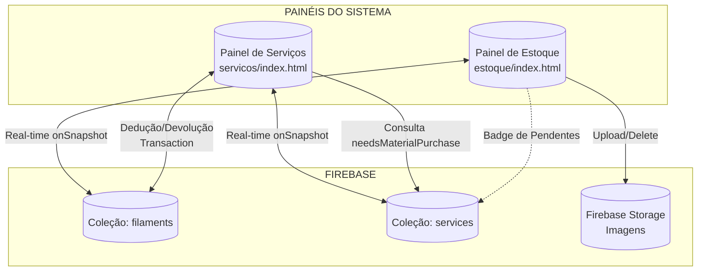

---

## 2. Fluxo de Autenticação do Painel de Estoque

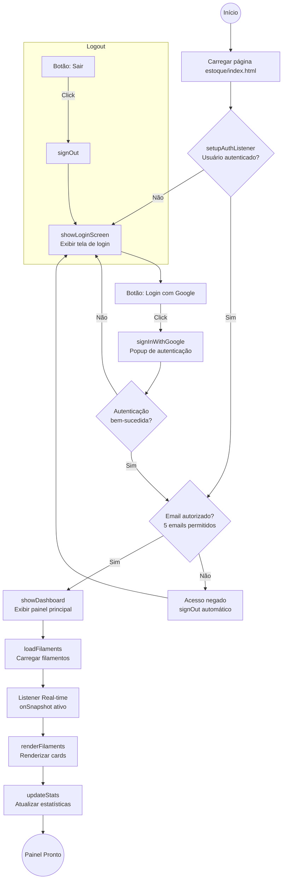

---

## 3. Estrutura do Dashboard de Estoque

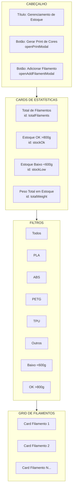

---

## 4. Estrutura do Card de Filamento

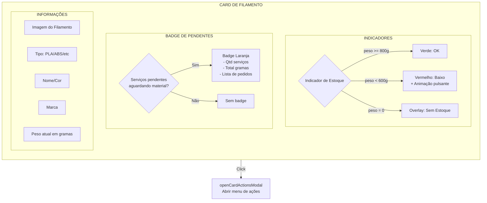

---

## 5. Fluxo de Filtros

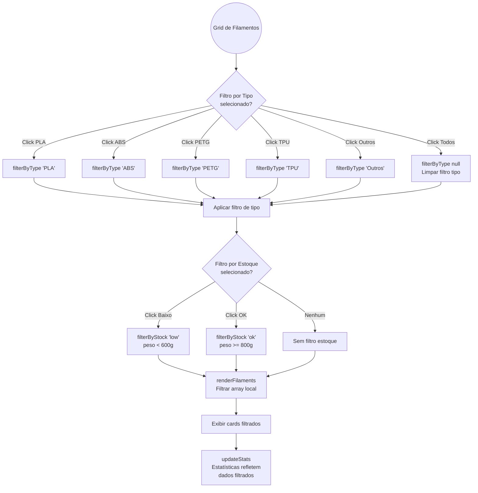

---

## 6. Modal de Adicionar/Editar Filamento

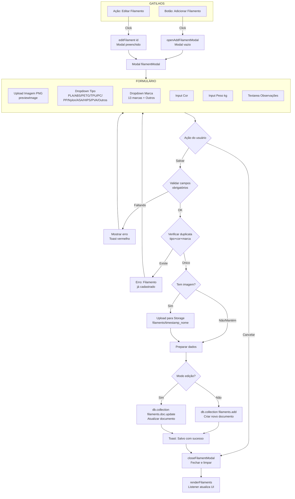

---

## 7. Modal de Ações do Card (Menu de Contexto)

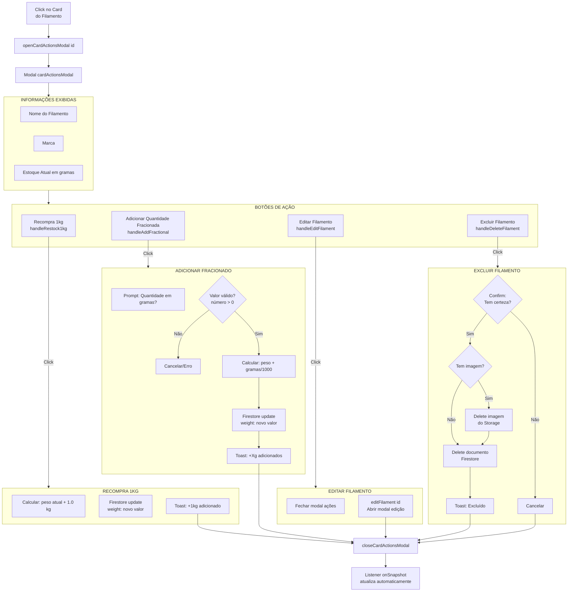

---

## 8. Fluxo Detalhado: Adição de Estoque

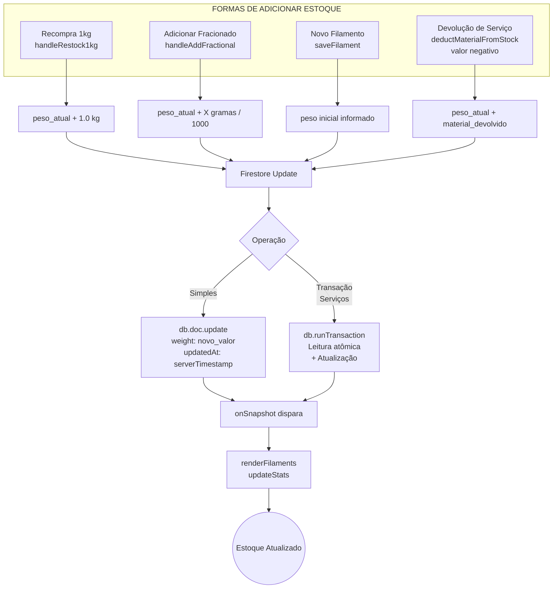

---

## 9. Fluxo Detalhado: Dedução de Estoque (Integração com Serviços)

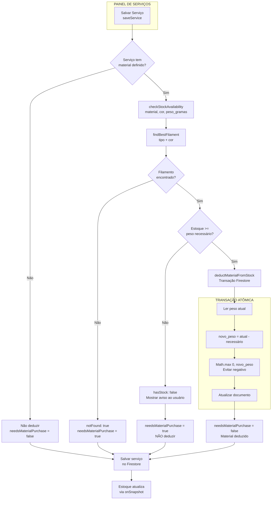

---

## 10. Fluxo de Edição de Serviço (Impacto no Estoque)

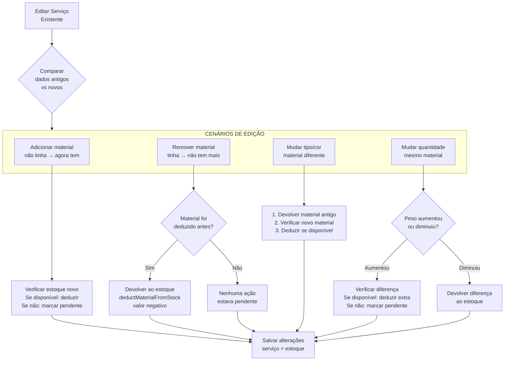

---

## 11. Fluxo de Exclusão de Serviço (Devolução ao Estoque)

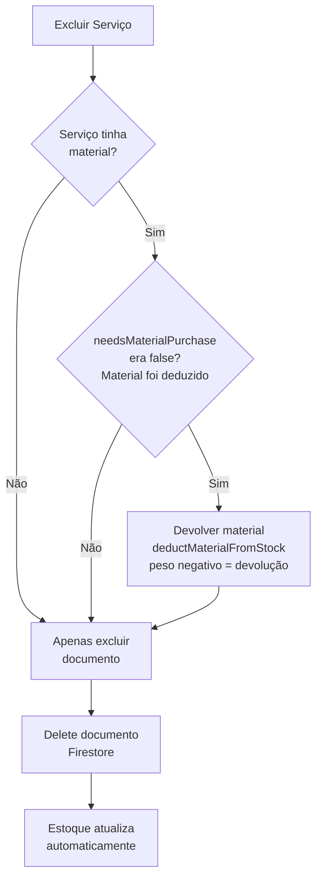

---

## 12. Modal de Geração de Print de Cores

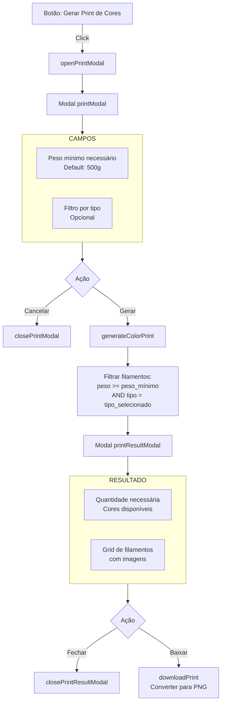

---

## 13. Fluxo de Sincronização Real-Time

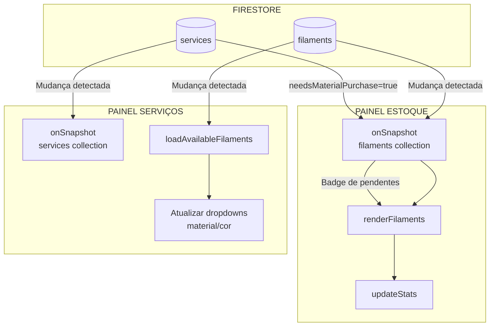

---

## 14. Tabela Completa de Botões e Ações

| Localização | Botão | Handler | Ação no Estoque |
|-------------|-------|---------|-----------------|
| Header | Gerar Print de Cores | `openPrintModal()` | Nenhuma - apenas consulta |
| Header | Adicionar Filamento | `openAddFilamentModal()` | **ADIÇÃO**: Novo registro |
| Filtros | Todos/PLA/ABS/PETG/TPU/Outros | `filterByType(tipo)` | Nenhuma - apenas visual |
| Filtros | Baixo/OK | `filterByStock(nivel)` | Nenhuma - apenas visual |
| Card | Click no card | `openCardActionsModal(id)` | Abre menu de ações |
| Modal Ações | Recompra 1kg | `handleRestock1kg()` | **ADIÇÃO**: +1000g |
| Modal Ações | Adicionar Fracionado | `handleAddFractional()` | **ADIÇÃO**: +Xg customizado |
| Modal Ações | Editar Filamento | `handleEditFilament()` | **EDIÇÃO**: Dados do registro |
| Modal Ações | Excluir Filamento | `handleDeleteFilament()` | **REMOÇÃO**: Delete completo |
| Modal Filamento | Cancelar | `closeFilamentModal()` | Nenhuma |
| Modal Filamento | Salvar | `saveFilament()` | **ADIÇÃO/EDIÇÃO** |
| Modal Print | Cancelar | `closePrintModal()` | Nenhuma |
| Modal Print | Gerar | `generateColorPrint()` | Nenhuma - apenas consulta |
| Modal Resultado | Fechar | `closePrintResultModal()` | Nenhuma |
| Modal Resultado | Baixar Imagem | `downloadPrint()` | Nenhuma |

---

## 15. Tabela de Impacto no Estoque por Operação de Serviço

| Operação | Condição | Ação no Estoque |
|----------|----------|-----------------|
| **Criar Serviço** | Com material + estoque disponível | **DEDUÇÃO** automática |
| **Criar Serviço** | Com material + sem estoque | Nenhuma (marca pendente) |
| **Criar Serviço** | Sem material | Nenhuma |
| **Editar Serviço** | Adicionar material + estoque OK | **DEDUÇÃO** automática |
| **Editar Serviço** | Adicionar material + sem estoque | Nenhuma (marca pendente) |
| **Editar Serviço** | Remover material (foi deduzido) | **DEVOLUÇÃO** automática |
| **Editar Serviço** | Remover material (não deduzido) | Nenhuma |
| **Editar Serviço** | Trocar material | **DEVOLUÇÃO** + **DEDUÇÃO** |
| **Editar Serviço** | Aumentar peso (estoque OK) | **DEDUÇÃO** da diferença |
| **Editar Serviço** | Aumentar peso (sem estoque) | Nenhuma (marca pendente) |
| **Editar Serviço** | Diminuir peso | **DEVOLUÇÃO** da diferença |
| **Excluir Serviço** | Material foi deduzido | **DEVOLUÇÃO** total |
| **Excluir Serviço** | Material não deduzido | Nenhuma |

---

## 16. Fluxograma Consolidado: Ciclo de Vida do Estoque

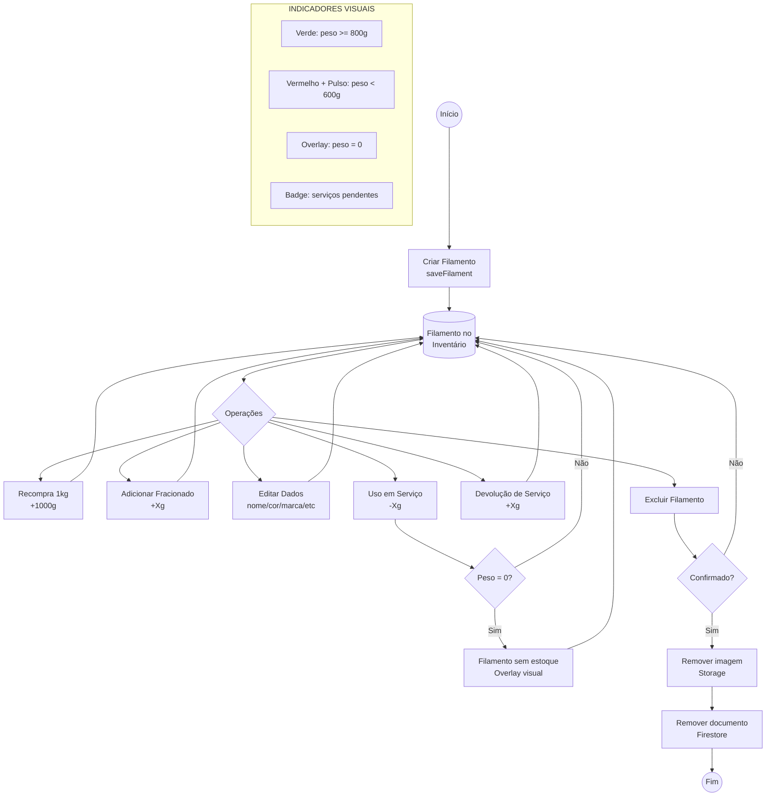

---

## 17. Estrutura de Dados Firestore

### Coleção: `filaments`
```javascript
{
  id: "auto-generated",           // ID único Firestore
  type: "PLA",                    // Tipo do material
  brand: "3D Fila",               // Marca
  color: "Preto",                 // Cor
  name: "PLA Preto",              // Nome composto
  weight: 0.850,                  // Peso em KG (850g)
  notes: "Observações",           // Texto livre
  imageUrl: "https://...",        // URL do Storage
  createdAt: Timestamp,           // Data criação
  updatedAt: Timestamp            // Última atualização
}
```

### Coleção: `services` (campos relevantes para estoque)
```javascript
{
  id: "auto-generated",
  material: "PLA",                // Tipo do material usado
  color: "Preto",                 // Cor do material
  materialWeight: 150,            // Peso em gramas
  needsMaterialPurchase: false,   // true = aguardando compra
  // ... outros campos do serviço
}
```

---

## 18. Resumo de Conexões entre Painéis

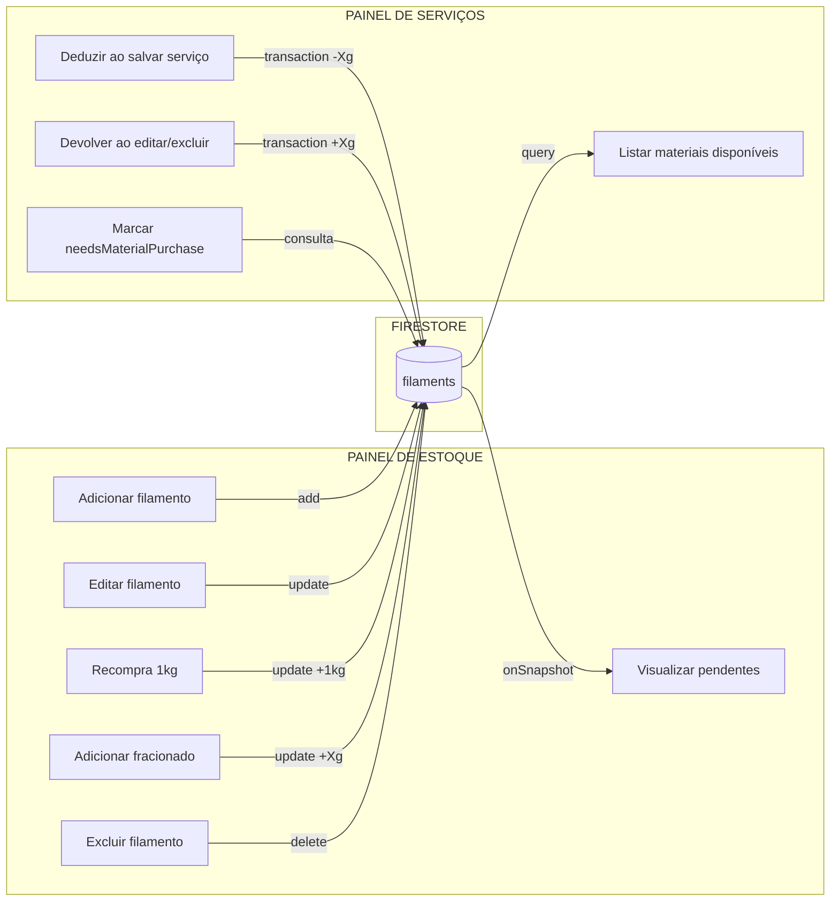

---

Este fluxograma documenta completamente:
- Todos os botões e suas funções
- Todos os fluxos de adição e dedução de estoque
- Integração bidirecional entre estoque e serviços
- Estrutura de dados no Firestore
- Indicadores visuais e seus gatilhos
- Operações atômicas com transações
