# Fluxogramas ImaginaTech

## 1. Fluxo Geral de Navegacao

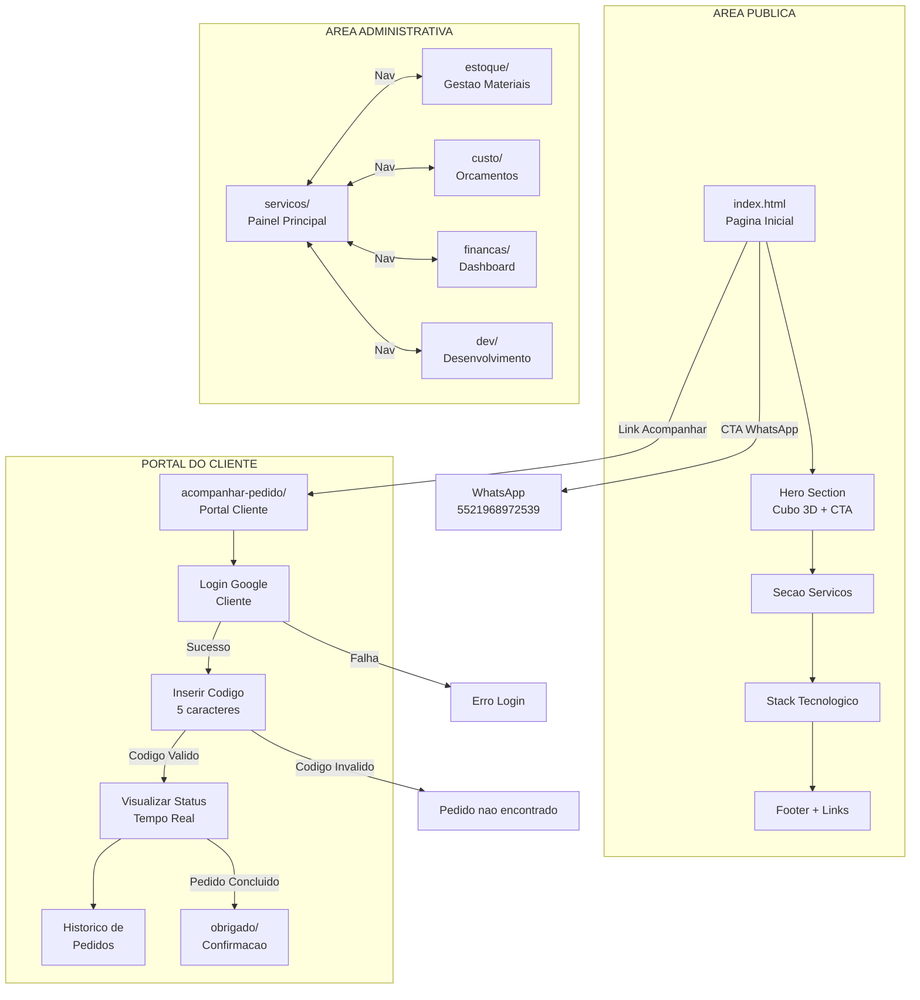

---

## 2. Fluxo de Autenticacao Admin

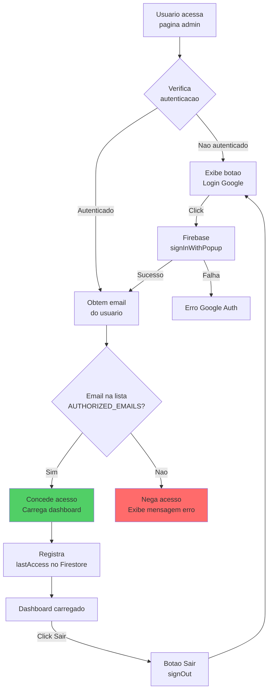

---

## 3. Fluxo Completo de Servicos (CRUD)

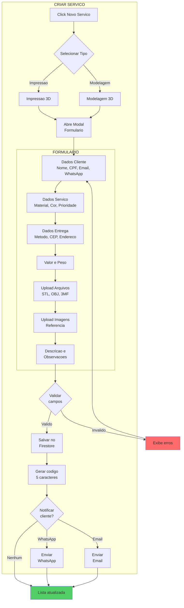

---

## 4. Fluxo de Status do Pedido (6 Estagios)

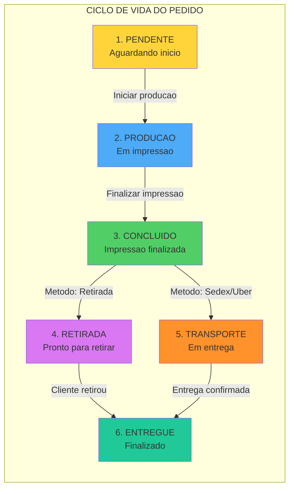

---

## 5. Fluxo Detalhado de Transicao de Status

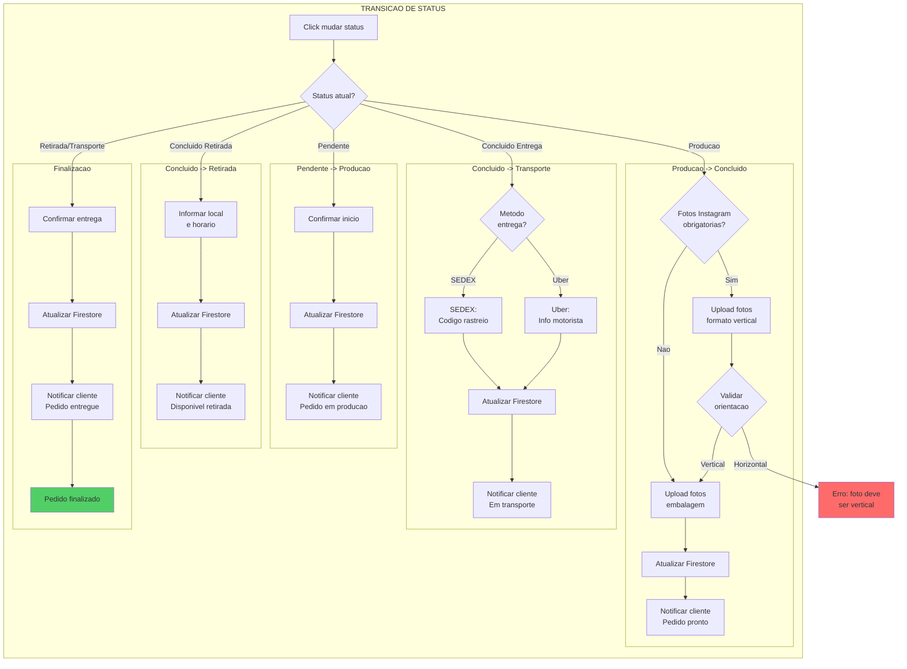

---

## 6. Fluxo do Estoque

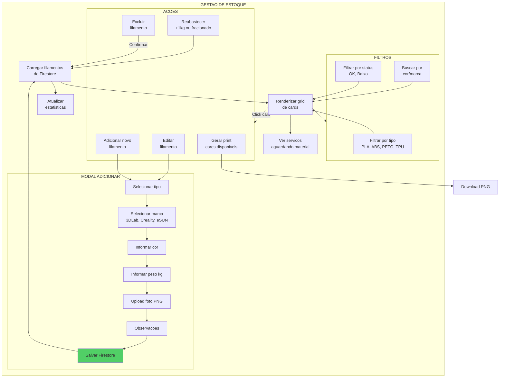

---

## 7. Fluxo do Cliente Acompanhar Pedido

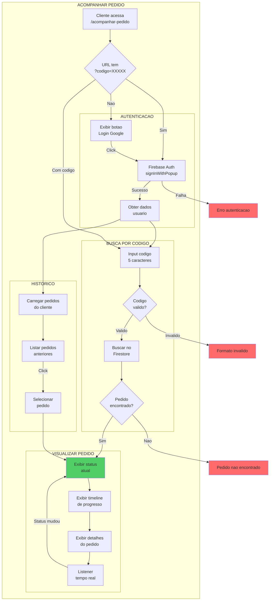

---

## 8. Fluxo Financeiro

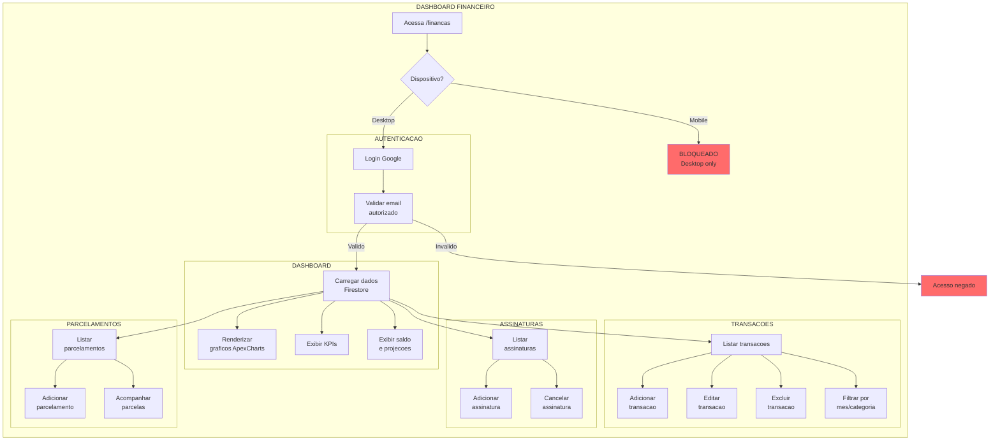

---

## 9. Fluxo de Upload de Arquivos

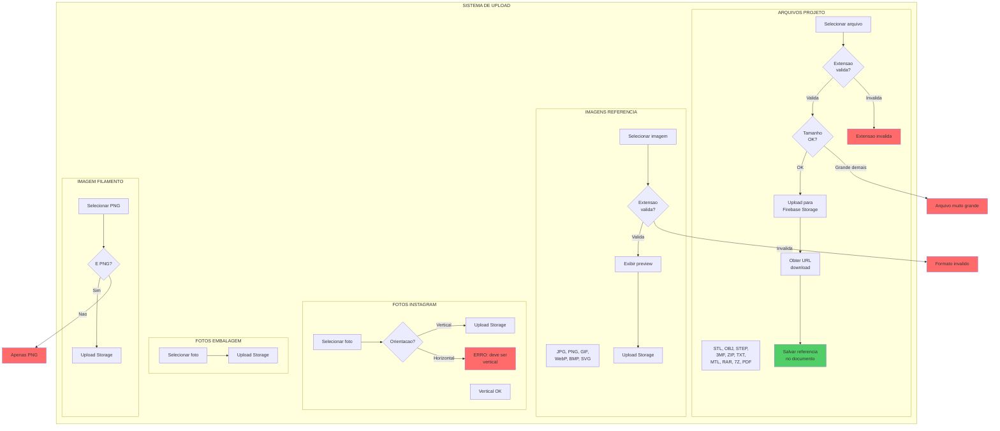

---

## 10. Fluxo de Notificacoes

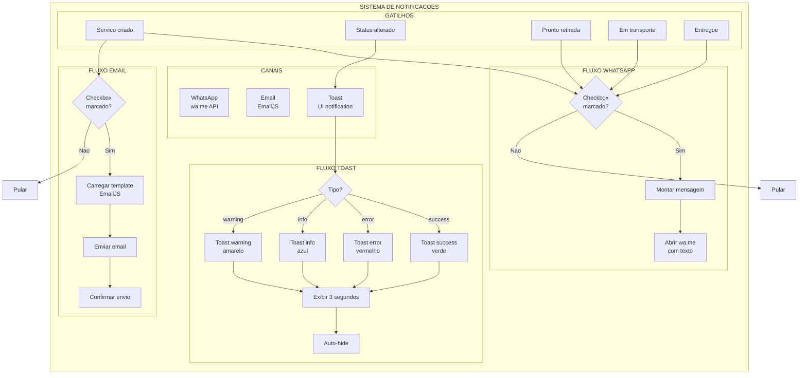

---

## 11. Fluxo de Integracao ViaCEP

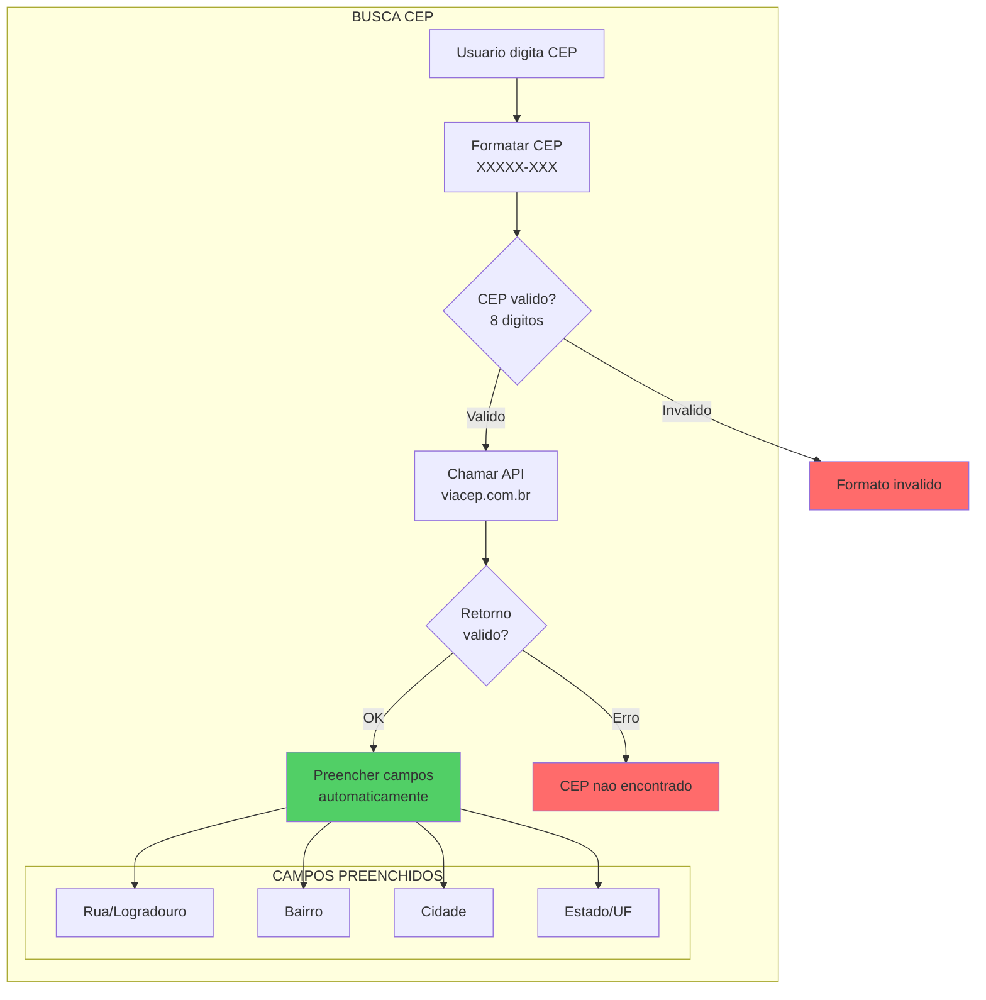

---

## 12. Fluxo Completo do Sistema (Visao Geral)

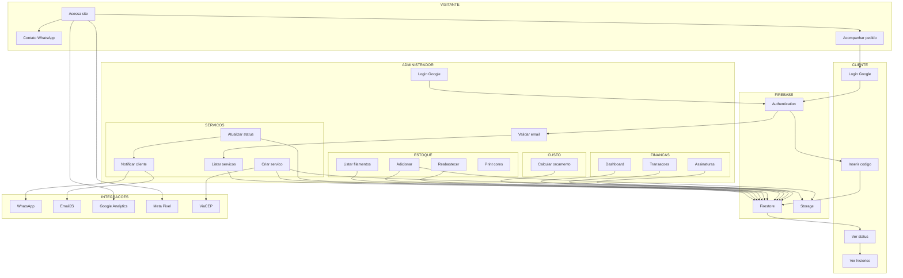

---

## Pontos de Atencao para Quebras de Logica

### Potenciais Problemas Identificados:

1. **Autenticacao**
   - Verificar se todos os modulos validam emails corretamente
   - Checar se sessao expira corretamente

2. **Status do Pedido**
   - Validar transicoes permitidas (nao pular etapas)
   - Garantir fotos obrigatorias antes de avancar

3. **Upload de Arquivos**
   - Validacao de extensoes em todos os pontos
   - Limite de tamanho de arquivo

4. **Notificacoes**
   - Verificar se WhatsApp abre corretamente
   - Checar se EmailJS esta configurado

5. **Dados do Cliente**
   - Validacao de CPF/CNPJ
   - Validacao de CEP com ViaCEP

6. **Mobile**
   - Financas bloqueado em mobile
   - Verificar responsividade das outras paginas

---

*Gerado automaticamente para identificacao de quebras de logica*
