# Fluxograma Completo do Painel de Servicos - ImaginaTech

> Este documento detalha TODAS as acoes, botoes, consequencias e fluxos do painel de servicos (`/servicos/`).
> Copie cada bloco de codigo mermaid e cole em https://mermaid.live para visualizar.

---

## 1. INICIALIZACAO DA PAGINA

```mermaid
flowchart TD
    subgraph INIT["INICIALIZACAO"]
        START["Usuario acessa<br/>/servicos/"]
        LOADING["Exibe Loading Overlay<br/>Conectando ao servidor..."]

        subgraph FIREBASE_INIT["INICIALIZACAO FIREBASE"]
            INIT_APP["firebase.initializeApp()"]
            INIT_DB["state.db = firebase.firestore()"]
            INIT_AUTH["state.auth = firebase.auth()"]
            INIT_STORAGE["state.storage = firebase.storage()"]
            INIT_EMAILJS["emailjs.init()"]
        end

        CHECK_INIT{"Firebase<br/>inicializado?"}
        ALERT_ERROR["alert: Erro critico<br/>Recarregue a pagina"]

        subgraph EVENTS["SETUP DE EVENTOS"]
            SETUP_DATE["setupDateFields()<br/>Define data inicio = hoje"]
            SETUP_PHONE["Listener formatPhoneNumber<br/>em clientPhone, pickupWhatsapp"]
            SETUP_CEP["Listener formatCEP<br/>em campo CEP"]
            SETUP_NOTIF["Listeners updateNotificationOptions<br/>em clientPhone, clientEmail"]
            MONITOR_CONN["monitorConnection()<br/>Monitora conexao internet"]
        end

        AUTH_STATE["auth.onAuthStateChanged()"]
        HIDE_LOADING["hideLoadingOverlay()"]
    end

    START --> LOADING
    LOADING --> INIT_APP
    INIT_APP --> INIT_DB
    INIT_DB --> INIT_AUTH
    INIT_AUTH --> INIT_STORAGE
    INIT_STORAGE --> INIT_EMAILJS
    INIT_EMAILJS --> CHECK_INIT
    CHECK_INIT -->|Falha| ALERT_ERROR
    CHECK_INIT -->|Sucesso| SETUP_DATE
    SETUP_DATE --> SETUP_PHONE
    SETUP_PHONE --> SETUP_CEP
    SETUP_CEP --> SETUP_NOTIF
    SETUP_NOTIF --> MONITOR_CONN
    MONITOR_CONN --> AUTH_STATE
    AUTH_STATE --> HIDE_LOADING

    style ALERT_ERROR fill:#ff6b6b
    style HIDE_LOADING fill:#51cf66
```

---

## 2. AUTENTICACAO COMPLETA

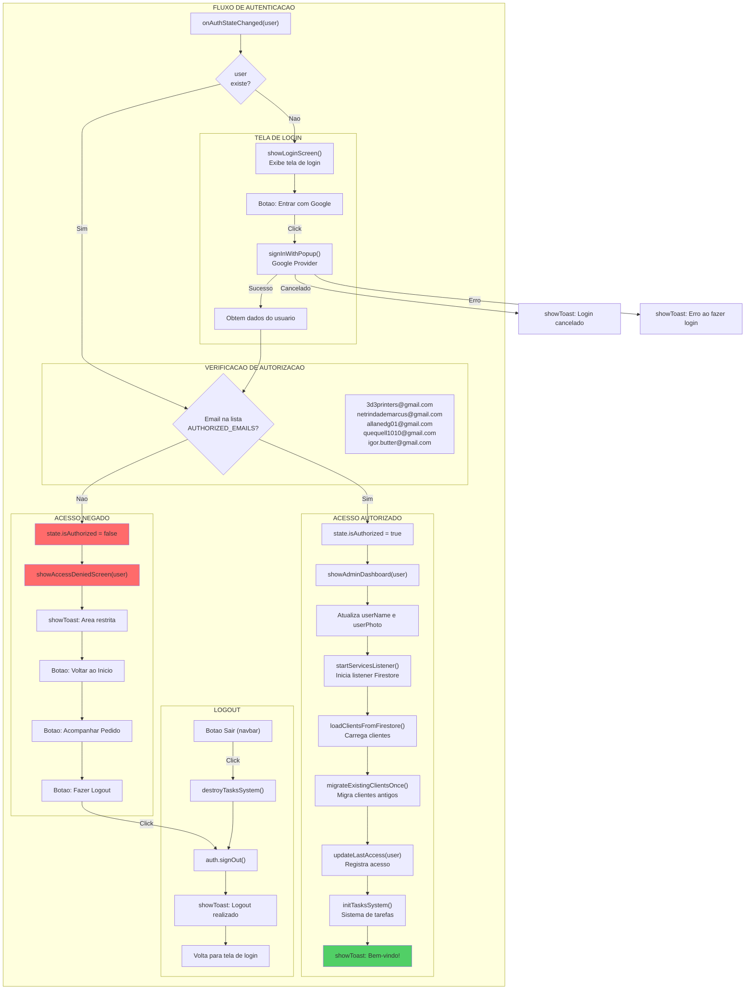

---

## 3. DASHBOARD E NAVEGACAO

```mermaid
flowchart TD
    subgraph DASHBOARD["DASHBOARD PRINCIPAL"]
        NAVBAR["NAVBAR"]

        subgraph NAV_LEFT["NAVBAR ESQUERDA"]
            LOGO["ImaginaTech<br/>Painel de Servicos"]
            CONN_STATUS["Status de Conexao<br/>Conectado/Offline"]
        end

        subgraph NAV_RIGHT["NAVBAR DIREITA"]
            BTN_ESTOQUE["Botao: Estoque<br/>href=/estoque/"]
            BTN_CAIXA["Botao: Caixa<br/>href=/caixa/"]
            BTN_CUSTO["Botao: Custo<br/>href=/custo/"]
            BTN_FINANCAS["Botao: Financas<br/>href=/financas/"]
            USER_INFO["Foto + Nome Usuario"]
            BTN_SAIR["Botao: Sair"]
        end

        subgraph ACTION_BAR["BARRA DE ACOES"]
            TITLE["Gerenciamento de Servicos"]
            BTN_NOVO["Botao: Novo Servico"]
        end

        subgraph STATS_GRID["GRID DE ESTATISTICAS"]
            STAT_ATIVOS["Card: Servicos Ativos<br/>stat-active<br/>filter: todos"]
            STAT_PEND["Card: Pendentes<br/>stat-pending<br/>filter: pendente"]
            STAT_PROD["Card: Em Producao<br/>stat-production<br/>filter: producao"]
            STAT_CONC["Card: Concluidos<br/>stat-completed<br/>filter: concluido"]
            STAT_RET["Card: Processo Entrega<br/>stat-ready<br/>filter: retirada"]
            STAT_ENT["Card: Entregues<br/>stat-delivered<br/>filter: entregue"]
        end

        SERVICES_GRID["servicesGrid<br/>Grid de cards de servicos"]
        EMPTY_STATE["emptyState<br/>Nenhum servico encontrado"]
    end

    NAVBAR --> NAV_LEFT
    NAVBAR --> NAV_RIGHT
    NAV_LEFT --> LOGO
    NAV_LEFT --> CONN_STATUS
    NAV_RIGHT --> BTN_ESTOQUE
    NAV_RIGHT --> BTN_CAIXA
    NAV_RIGHT --> BTN_CUSTO
    NAV_RIGHT --> BTN_FINANCAS
    NAV_RIGHT --> USER_INFO
    NAV_RIGHT --> BTN_SAIR

    BTN_ESTOQUE -->|Click| GOTO_EST["/estoque/"]
    BTN_CAIXA -->|Click| GOTO_CX["/caixa/"]
    BTN_CUSTO -->|Click| GOTO_CST["/custo/"]
    BTN_FINANCAS -->|Click| GOTO_FIN["/financas/"]
    BTN_SAIR -->|Click| LOGOUT["signOutGlobal()"]

    ACTION_BAR --> TITLE
    ACTION_BAR --> BTN_NOVO
    BTN_NOVO -->|Click| OPEN_TYPE_MODAL["openAddModal()<br/>Abre modal tipo servico"]

    STATS_GRID --> STAT_ATIVOS
    STATS_GRID --> STAT_PEND
    STATS_GRID --> STAT_PROD
    STATS_GRID --> STAT_CONC
    STATS_GRID --> STAT_RET
    STATS_GRID --> STAT_ENT

    STAT_ATIVOS -->|Click| FILTER_TODOS["filterServices('todos')"]
    STAT_PEND -->|Click| FILTER_PEND["filterServices('pendente')"]
    STAT_PROD -->|Click| FILTER_PROD["filterServices('producao')"]
    STAT_CONC -->|Click| FILTER_CONC["filterServices('concluido')"]
    STAT_RET -->|Click| FILTER_RET["filterServices('retirada')"]
    STAT_ENT -->|Click| FILTER_ENT["filterServices('entregue')"]
```

---

## 4. FILTRO DE SERVICOS

```mermaid
flowchart TD
    subgraph FILTER["SISTEMA DE FILTROS"]
        CLICK_STAT["Click em stat-card"]
        SET_FILTER["state.currentFilter = filter"]
        REMOVE_ACTIVE["Remove classe active<br/>de todos os cards"]
        ADD_ACTIVE["Adiciona classe active<br/>no card clicado"]
        CALL_RENDER["renderServices()"]

        subgraph FILTER_LOGIC["LOGICA DE FILTRAGEM"]
            CHECK_FILTER{"Qual filtro?"}

            FILTER_TODOS_LOGIC["filter: todos<br/>Exclui entregue, retirada,<br/>modelagem_concluida"]
            FILTER_PROD_LOGIC["filter: producao<br/>Inclui producao + modelando"]
            FILTER_CONC_LOGIC["filter: concluido<br/>Inclui concluido +<br/>modelagem_concluida"]
            FILTER_OTHER["Outros filtros<br/>Filtra por status exato"]
        end

        subgraph SORT_LOGIC["ORDENACAO"]
            CHECK_SORT{"Status do filtro?"}
            SORT_COMPLETED["Ordena por completedAt<br/>(mais recente primeiro)"]
            SORT_DELIVERED["Ordena por deliveredAt<br/>(mais recente primeiro)"]
            SORT_PRIORITY["Ordena por prioridade<br/>urgente > alta > media > baixa<br/>Depois por dueDate"]
        end

        CHECK_EMPTY{"Lista vazia?"}
        SHOW_EMPTY["Exibe emptyState<br/>Nenhum servico X encontrado"]
        SHOW_GRID["Exibe servicesGrid<br/>Renderiza cards"]
    end

    CLICK_STAT --> SET_FILTER
    SET_FILTER --> REMOVE_ACTIVE
    REMOVE_ACTIVE --> ADD_ACTIVE
    ADD_ACTIVE --> CALL_RENDER
    CALL_RENDER --> CHECK_FILTER

    CHECK_FILTER -->|todos| FILTER_TODOS_LOGIC
    CHECK_FILTER -->|producao| FILTER_PROD_LOGIC
    CHECK_FILTER -->|concluido| FILTER_CONC_LOGIC
    CHECK_FILTER -->|outro| FILTER_OTHER

    FILTER_TODOS_LOGIC --> CHECK_SORT
    FILTER_PROD_LOGIC --> CHECK_SORT
    FILTER_CONC_LOGIC --> CHECK_SORT
    FILTER_OTHER --> CHECK_SORT

    CHECK_SORT -->|concluido| SORT_COMPLETED
    CHECK_SORT -->|entregue| SORT_DELIVERED
    CHECK_SORT -->|outros| SORT_PRIORITY

    SORT_COMPLETED --> CHECK_EMPTY
    SORT_DELIVERED --> CHECK_EMPTY
    SORT_PRIORITY --> CHECK_EMPTY

    CHECK_EMPTY -->|Sim| SHOW_EMPTY
    CHECK_EMPTY -->|Nao| SHOW_GRID

    style SHOW_EMPTY fill:#ffd43b
    style SHOW_GRID fill:#51cf66
```

---

## 5. CRIAR NOVO SERVICO - FLUXO COMPLETO

```mermaid
flowchart TD
    subgraph CREATE["CRIAR NOVO SERVICO"]
        BTN_NOVO["Click: Novo Servico"]
        OPEN_TYPE_MODAL["Abre serviceTypeModal"]

        subgraph SELECT_TYPE["SELECAO DE TIPO"]
            BTN_IMPRESSAO["Botao: Servico de Impressao<br/>Impressao 3D com entrega fisica"]
            BTN_MODELAGEM["Botao: Servico de Modelagem<br/>Modelagem 3D digital"]
        end

        CLOSE_TYPE_MODAL["closeServiceTypeModal()"]
        SET_TYPE["state.currentServiceType = tipo"]
        CLEAR_STATE["state.editingServiceId = null<br/>state.selectedFiles = []<br/>state.selectedImages = []"]

        subgraph FORM_SETUP["SETUP DO FORMULARIO"]
            SET_TITLE["modalTitle = 'Novo Servico de X'"]
            RESET_FORM["serviceForm.reset()"]
            HIDE_ORDER_CODE["orderCodeDisplay.style = none"]
            SETUP_DATE_FIELDS["setupDateFields()<br/>startDate = hoje"]
            CLEAR_PREVIEWS["Limpa filesPreviewContainer<br/>Limpa imagePreviewContainer"]
            SET_PRIORITY["servicePriority = media"]
            SET_STATUS["serviceStatus = pendente/modelando"]
            HIDE_NOTIF["notificationSection.style = none"]
            HIDE_DELIVERY["hideAllDeliveryFields()"]
        end

        subgraph ADAPT_FORM["ADAPTAR FORMULARIO"]
            CHECK_TYPE{"Tipo?"}

            subgraph IMPRESSAO_FORM["FORMULARIO IMPRESSAO"]
                SHOW_MATERIAL["Exibe campo Material"]
                SHOW_COLOR["Exibe campo Cor"]
                SHOW_WEIGHT["Exibe campo Peso"]
                SHOW_DELIVERY["Exibe campo Metodo Entrega"]
                LOAD_FILAMENTS["loadAvailableFilaments()<br/>Carrega estoque"]
                UPDATE_MATERIAL_DD["updateMaterialDropdown()<br/>Popula materiais em estoque"]
                SETUP_COLOR_LISTENER["Listener change em material<br/>Atualiza cores disponiveis"]
            end

            subgraph MODELAGEM_FORM["FORMULARIO MODELAGEM"]
                HIDE_MATERIAL["Oculta campo Material"]
                HIDE_COLOR["Oculta campo Cor"]
                HIDE_WEIGHT["Oculta campo Peso"]
                HIDE_DELIVERY_M["Oculta campo Metodo Entrega"]
                REMOVE_REQUIRED["Remove required dos campos"]
            end
        end

        OPEN_SERVICE_MODAL["serviceModal.classList.add('active')"]
    end

    BTN_NOVO --> OPEN_TYPE_MODAL
    OPEN_TYPE_MODAL --> BTN_IMPRESSAO
    OPEN_TYPE_MODAL --> BTN_MODELAGEM

    BTN_IMPRESSAO -->|Click| CLOSE_TYPE_MODAL
    BTN_MODELAGEM -->|Click| CLOSE_TYPE_MODAL

    CLOSE_TYPE_MODAL --> SET_TYPE
    SET_TYPE --> CLEAR_STATE
    CLEAR_STATE --> SET_TITLE
    SET_TITLE --> RESET_FORM
    RESET_FORM --> HIDE_ORDER_CODE
    HIDE_ORDER_CODE --> SETUP_DATE_FIELDS
    SETUP_DATE_FIELDS --> CLEAR_PREVIEWS
    CLEAR_PREVIEWS --> SET_PRIORITY
    SET_PRIORITY --> SET_STATUS
    SET_STATUS --> HIDE_NOTIF
    HIDE_NOTIF --> HIDE_DELIVERY
    HIDE_DELIVERY --> CHECK_TYPE

    CHECK_TYPE -->|impressao| SHOW_MATERIAL
    SHOW_MATERIAL --> SHOW_COLOR
    SHOW_COLOR --> SHOW_WEIGHT
    SHOW_WEIGHT --> SHOW_DELIVERY
    SHOW_DELIVERY --> LOAD_FILAMENTS
    LOAD_FILAMENTS --> UPDATE_MATERIAL_DD
    UPDATE_MATERIAL_DD --> SETUP_COLOR_LISTENER
    SETUP_COLOR_LISTENER --> OPEN_SERVICE_MODAL

    CHECK_TYPE -->|modelagem| HIDE_MATERIAL
    HIDE_MATERIAL --> HIDE_COLOR
    HIDE_COLOR --> HIDE_WEIGHT
    HIDE_WEIGHT --> HIDE_DELIVERY_M
    HIDE_DELIVERY_M --> REMOVE_REQUIRED
    REMOVE_REQUIRED --> OPEN_SERVICE_MODAL

    style OPEN_SERVICE_MODAL fill:#51cf66
```

---

## 6. FORMULARIO DE SERVICO - CAMPOS E INTERACOES

```mermaid
flowchart TD
    subgraph FORM["FORMULARIO DE SERVICO"]
        subgraph DADOS_BASICOS["DADOS BASICOS"]
            NOME_SERVICO["serviceName *<br/>Nome do Servico"]
            NOME_CLIENTE["clientName *<br/>Nome do Cliente"]
            CPF_CLIENTE["clientCPF<br/>CPF/CNPJ"]
            EMAIL_CLIENTE["clientEmail<br/>Email"]
            PHONE_CLIENTE["clientPhone<br/>WhatsApp"]
        end

        subgraph AUTOCOMPLETE["AUTOCOMPLETE CLIENTE"]
            INPUT_NOME["Digita nome (min 2 chars)"]
            SEARCH_CACHE["Busca em clientsCache"]
            SHOW_SUGGESTIONS["Exibe clientSuggestions"]
            CLICK_SUGGESTION["Click em sugestao"]
            FILL_FIELDS["Preenche todos os campos<br/>nome, cpf, email, phone, endereco"]
            HIDE_SUGGESTIONS["Oculta suggestions"]
        end

        subgraph MATERIAL_COR["MATERIAL E COR (Impressao)"]
            SELECT_MATERIAL["serviceMaterial *<br/>Carregado do estoque"]
            ON_MATERIAL_CHANGE["onChange: handleMaterialChange"]
            UPDATE_COLORS["updateColorDropdown()<br/>Filtra cores disponiveis"]
            SELECT_COLOR["serviceColor<br/>Cores em estoque"]
        end

        subgraph ENTREGA["METODO DE ENTREGA (Impressao)"]
            SELECT_DELIVERY["deliveryMethod *"]
            ON_DELIVERY_CHANGE["onChange: toggleDeliveryFields()"]

            subgraph RETIRADA_FIELDS["CAMPOS RETIRADA"]
                PICKUP_NAME["pickupName *<br/>Nome quem retira"]
                PICKUP_WHATS["pickupWhatsapp *"]
                BTN_COPY_CLIENT["Copiar Dados do Cliente"]
            end

            subgraph SEDEX_FIELDS["CAMPOS SEDEX"]
                FULL_NAME["fullName *"]
                CPF_CNPJ["cpfCnpj *"]
                EMAIL_ENTREGA["email *"]
                TELEFONE["telefone *"]
                CEP["cep * + buscarCEP()"]
                ESTADO["estado *"]
                CIDADE["cidade *"]
                BAIRRO["bairro *"]
                RUA["rua *"]
                NUMERO["numero *"]
                COMPLEMENTO["complemento"]
                TRACKING["editTrackingCode<br/>(ao editar)"]
            end
        end

        subgraph PRIORIDADE_DATAS["PRIORIDADE E DATAS"]
            SELECT_PRIORITY["servicePriority *<br/>baixa/media/alta/urgente"]
            START_DATE["startDate *"]
            DUE_DATE["dueDate *"]
            DATE_UNDEFINED["checkbox: Data a definir<br/>toggleDateInput()"]
        end

        subgraph VALOR_PESO["VALOR E PESO"]
            SERVICE_VALUE["serviceValue<br/>Valor R$"]
            SERVICE_WEIGHT["serviceWeight<br/>Peso gramas (Impressao)"]
        end

        subgraph ARQUIVOS["ARQUIVOS E IMAGENS"]
            FILE_INPUT["serviceFiles<br/>STL, OBJ, STEP, 3MF, ZIP..."]
            ON_FILE_SELECT["onChange: handleFileSelect()"]
            FILE_PREVIEW["filesPreviewContainer<br/>Lista de arquivos"]
            FILE_IN_DRIVE["checkbox: Arquivo no Drive"]

            IMAGE_INPUT["serviceImage<br/>JPG, PNG, GIF, WebP..."]
            ON_IMAGE_SELECT["onChange: handleImageSelect()"]
            IMAGE_PREVIEW["imagePreviewContainer<br/>Grid de previews"]
        end

        subgraph DESCRICAO["DESCRICAO"]
            SERVICE_DESC["serviceDescription<br/>Detalhes do servico"]
            SERVICE_OBS["serviceObservations<br/>Observacoes importantes"]
        end

        subgraph NOTIFICACOES["NOTIFICACOES (ao criar)"]
            SECTION_NOTIF["notificationSection"]
            CHECK_WHATSAPP["sendWhatsappOnCreate<br/>Enviar WhatsApp"]
            CHECK_EMAIL["sendEmailOnCreate<br/>Enviar Email"]
        end

        subgraph FOOTER["FOOTER DO MODAL"]
            BTN_CANCEL["Botao: Cancelar<br/>closeModal()"]
            BTN_SAVE["Botao: Salvar Servico<br/>saveService(event)"]
        end
    end

    INPUT_NOME -->|input event| SEARCH_CACHE
    SEARCH_CACHE -->|matches > 0| SHOW_SUGGESTIONS
    SHOW_SUGGESTIONS -->|click| CLICK_SUGGESTION
    CLICK_SUGGESTION --> FILL_FIELDS
    FILL_FIELDS --> HIDE_SUGGESTIONS

    SELECT_MATERIAL --> ON_MATERIAL_CHANGE
    ON_MATERIAL_CHANGE --> UPDATE_COLORS
    UPDATE_COLORS --> SELECT_COLOR

    SELECT_DELIVERY --> ON_DELIVERY_CHANGE
    ON_DELIVERY_CHANGE -->|retirada| RETIRADA_FIELDS
    ON_DELIVERY_CHANGE -->|sedex| SEDEX_FIELDS
    ON_DELIVERY_CHANGE -->|uber/definir| HIDE_FIELDS["Oculta campos"]

    CEP -->|onblur| VIACEP["buscarCEP()<br/>API ViaCEP"]
    VIACEP -->|sucesso| AUTO_FILL["Preenche estado, cidade,<br/>bairro, rua"]

    DATE_UNDEFINED -->|checked| DISABLE_DUE["dueDate.disabled = true"]

    FILE_INPUT --> ON_FILE_SELECT
    ON_FILE_SELECT --> FILE_PREVIEW

    IMAGE_INPUT --> ON_IMAGE_SELECT
    ON_IMAGE_SELECT --> IMAGE_PREVIEW

    PHONE_CLIENTE -->|input| UPDATE_NOTIF_OPT["updateNotificationOptions()"]
    EMAIL_CLIENTE -->|input| UPDATE_NOTIF_OPT
    UPDATE_NOTIF_OPT --> SHOW_NOTIF["Exibe opcoes de notificacao"]

    BTN_CANCEL -->|click| CLOSE_MODAL["closeModal()"]
    BTN_SAVE -->|click| SAVE_SERVICE["saveService(event)"]
```

---

## 7. SALVAR SERVICO - LOGICA COMPLETA

```mermaid
flowchart TD
    subgraph SAVE["SALVAR SERVICO"]
        BTN_SAVE["Click: Salvar Servico"]
        PREVENT_DEFAULT["event.preventDefault()"]

        subgraph VALIDACOES["VALIDACOES"]
            CHECK_AUTH{"isAuthorized<br/>e db existe?"}
            ERROR_AUTH["showToast: Sem permissao"]

            GET_TYPE["Determina serviceType<br/>impressao ou modelagem"]

            CHECK_DELIVERY{"Impressao sem<br/>deliveryMethod?"}
            ERROR_DELIVERY["showToast: Selecione metodo"]

            CHECK_DATE{"dueDate < startDate?"}
            ERROR_DATE["showToast: Data invalida"]

            CHECK_RETIRADA{"Retirada sem<br/>nome/whatsapp?"}
            ERROR_RETIRADA["showToast: Preencha campos"]

            CHECK_SEDEX{"Sedex sem campos<br/>obrigatorios?"}
            ERROR_SEDEX["showToast: Preencha endereco"]

            CHECK_EMAIL_VALID{"Email invalido?"}
            ERROR_EMAIL["showToast: Email invalido"]
        end

        subgraph BUILD_SERVICE["MONTAR OBJETO SERVICE"]
            GET_FIELDS["Obtem valores de todos os campos"]
            SET_UPDATED["updatedAt = now<br/>updatedBy = user.email"]

            subgraph IMPRESSAO_FIELDS["CAMPOS IMPRESSAO"]
                SET_MATERIAL["service.material"]
                SET_COLOR["service.color"]
                SET_WEIGHT["service.weight"]
                SET_DELIVERY_M["service.deliveryMethod"]
            end

            subgraph MODELAGEM_FIELDS["CAMPOS MODELAGEM"]
                SET_DIGITAL["deliveryMethod = digital"]
            end
        end

        subgraph STOCK_LOGIC["LOGICA DE ESTOQUE (Impressao)"]
            CHECK_EDITING{"Editando<br/>servico?"}

            subgraph NEW_SERVICE_STOCK["NOVO SERVICO"]
                CHECK_HAS_MATERIAL{"Tem material,<br/>cor e peso?"}
                CHECK_STOCK_NEW["checkStockAvailability()"]
                HAS_STOCK_NEW{"Tem estoque?"}
                DEDUCT_NEW["materialToDeduct = peso<br/>needsMaterialPurchase = false"]
                NO_STOCK_NEW["needsMaterialPurchase = true<br/>showToast: Estoque insuficiente"]
            end

            subgraph EDIT_SERVICE_STOCK["EDITANDO SERVICO"]
                GET_OLD["Obtem servico antigo"]
                COMPARE["Compara material/cor/peso"]

                CASE_ADD["CASO 1: Adicionando material"]
                CASE_CHANGE["CASO 2A: Mudou tipo/cor"]
                CASE_WEIGHT["CASO 2B: Mudou apenas peso"]
                CASE_REMOVE["CASO 3: Removendo material"]

                RETURN_OLD["Devolve material antigo<br/>deductMaterialFromStock(-peso)"]
                DEDUCT_DIFF["Deduz diferenca"]
            end
        end

        subgraph SAVE_DB["SALVAR NO FIRESTORE"]
            CHECK_EDITING_SAVE{"Editando?"}

            subgraph UPDATE_EXISTING["ATUALIZAR EXISTENTE"]
                UPDATE_DOC["db.collection('services')<br/>.doc(id).update(service)"]
                DEDUCT_STOCK_UPD["deductMaterialFromStock()<br/>se materialToDeduct > 0"]
                TOAST_UPD["showToast: Servico atualizado"]
            end

            subgraph CREATE_NEW["CRIAR NOVO"]
                SET_CREATED["createdAt = now<br/>createdBy = user.email"]
                SET_IDS["userId = COMPANY_USER_ID<br/>companyId = COMPANY_USER_ID"]
                GEN_CODE["orderCode = generateOrderCode()<br/>5 caracteres aleatorios"]
                SET_SERVICE_ID["serviceId = SRV-timestamp"]
                ADD_DOC["db.collection('services').add(service)"]
                SHOW_CODE["Exibe orderCodeDisplay"]
                DEDUCT_STOCK_NEW["deductMaterialFromStock()<br/>se materialToDeduct > 0"]
                TOAST_NEW["showToast: Servico criado!<br/>Codigo: XXXXX"]
            end
        end

        subgraph NOTIFICATIONS["NOTIFICACOES AO CRIAR"]
            CHECK_WHATS{"sendWhatsappOnCreate<br/>e tem phone?"}
            SEND_WHATS["sendWhatsAppMessage()<br/>Abre wa.me"]

            CHECK_EMAIL_SEND{"sendEmailOnCreate<br/>e tem email?"}
            SEND_EMAIL["sendEmailNotification()<br/>via EmailJS"]
        end

        subgraph SAVE_CLIENT["SALVAR CLIENTE"]
            HAS_CLIENT{"Tem nome<br/>de cliente?"}
            BUILD_CLIENT["Monta clientData"]
            SAVE_CLIENT_DB["saveClientToFirestore()"]
        end

        subgraph UPLOAD_FILES["UPLOAD DE ARQUIVOS"]
            HAS_FILES{"selectedFiles > 0?"}
            TOAST_UPLOAD_F["showToast: Preparando upload"]
            UPLOAD_F["uploadMultipleFiles()"]
            UPDATE_FILES["Atualiza service.files"]
            TOAST_F_OK["showToast: Arquivos enviados"]

            HAS_IMAGES{"selectedImages > 0?"}
            TOAST_UPLOAD_I["showToast: Preparando upload"]
            UPLOAD_I["uploadMultipleFiles()"]
            UPDATE_IMAGES["Atualiza service.images"]
            TOAST_I_OK["showToast: Imagens enviadas"]
        end

        CLOSE_MODAL["closeModal()"]
    end

    BTN_SAVE --> PREVENT_DEFAULT
    PREVENT_DEFAULT --> CHECK_AUTH
    CHECK_AUTH -->|Nao| ERROR_AUTH
    CHECK_AUTH -->|Sim| GET_TYPE
    GET_TYPE --> CHECK_DELIVERY
    CHECK_DELIVERY -->|Sim| ERROR_DELIVERY
    CHECK_DELIVERY -->|Nao| CHECK_DATE
    CHECK_DATE -->|Sim| ERROR_DATE
    CHECK_DATE -->|Nao| GET_FIELDS

    GET_FIELDS --> CHECK_EDITING
    CHECK_EDITING -->|Nao| CHECK_HAS_MATERIAL
    CHECK_HAS_MATERIAL -->|Sim| CHECK_STOCK_NEW
    CHECK_STOCK_NEW --> HAS_STOCK_NEW
    HAS_STOCK_NEW -->|Sim| DEDUCT_NEW
    HAS_STOCK_NEW -->|Nao| NO_STOCK_NEW

    CHECK_EDITING -->|Sim| GET_OLD
    GET_OLD --> COMPARE

    DEDUCT_NEW --> CHECK_EDITING_SAVE
    NO_STOCK_NEW --> CHECK_EDITING_SAVE
    COMPARE --> CHECK_EDITING_SAVE

    CHECK_EDITING_SAVE -->|Sim| UPDATE_DOC
    UPDATE_DOC --> DEDUCT_STOCK_UPD
    DEDUCT_STOCK_UPD --> TOAST_UPD

    CHECK_EDITING_SAVE -->|Nao| SET_CREATED
    SET_CREATED --> SET_IDS
    SET_IDS --> GEN_CODE
    GEN_CODE --> SET_SERVICE_ID
    SET_SERVICE_ID --> ADD_DOC
    ADD_DOC --> SHOW_CODE
    SHOW_CODE --> DEDUCT_STOCK_NEW
    DEDUCT_STOCK_NEW --> TOAST_NEW

    TOAST_UPD --> HAS_CLIENT
    TOAST_NEW --> CHECK_WHATS

    CHECK_WHATS -->|Sim| SEND_WHATS
    CHECK_WHATS -->|Nao| CHECK_EMAIL_SEND
    SEND_WHATS --> CHECK_EMAIL_SEND
    CHECK_EMAIL_SEND -->|Sim| SEND_EMAIL
    CHECK_EMAIL_SEND -->|Nao| HAS_CLIENT
    SEND_EMAIL --> HAS_CLIENT

    HAS_CLIENT -->|Sim| BUILD_CLIENT
    BUILD_CLIENT --> SAVE_CLIENT_DB
    SAVE_CLIENT_DB --> HAS_FILES
    HAS_CLIENT -->|Nao| HAS_FILES

    HAS_FILES -->|Sim| TOAST_UPLOAD_F
    TOAST_UPLOAD_F --> UPLOAD_F
    UPLOAD_F --> UPDATE_FILES
    UPDATE_FILES --> TOAST_F_OK
    TOAST_F_OK --> HAS_IMAGES
    HAS_FILES -->|Nao| HAS_IMAGES

    HAS_IMAGES -->|Sim| TOAST_UPLOAD_I
    TOAST_UPLOAD_I --> UPLOAD_I
    UPLOAD_I --> UPDATE_IMAGES
    UPDATE_IMAGES --> TOAST_I_OK
    TOAST_I_OK --> CLOSE_MODAL
    HAS_IMAGES -->|Nao| CLOSE_MODAL

    style CLOSE_MODAL fill:#51cf66
    style ERROR_AUTH fill:#ff6b6b
    style ERROR_DELIVERY fill:#ff6b6b
    style ERROR_DATE fill:#ff6b6b
```

---

## 8. CARD DE SERVICO - ESTRUTURA E ACOES

```mermaid
flowchart TD
    subgraph CARD["ESTRUTURA DO CARD DE SERVICO"]
        CARD_ROOT["service-card<br/>priority-X service-impressao/modelagem"]

        subgraph HEADER["CARD HEADER"]
            SERVICE_NAME["Nome do Servico"]
            SERVICE_TYPE["Badge: Impressao/Modelagem"]
            ORDER_CODE["Codigo: XXXXX"]
            BTN_EDIT["Botao Editar<br/>openEditModal(id)"]
            BTN_DELETE["Botao Excluir<br/>deleteServiceGlobal(id)"]
        end

        subgraph ALERTS["ALERTAS"]
            MATERIAL_ALERT["ALERTA: COMPRAR MATERIAL<br/>(se needsMaterialPurchase)"]
        end

        subgraph DELIVERY_BADGE["BADGE DE ENTREGA"]
            DELIVERY_METHOD["Icone + Metodo<br/>+ codigo rastreio"]
            DAYS_REMAINING["Dias restantes<br/>ou Entregue"]
        end

        subgraph INFO_GRID["INFORMACOES"]
            INFO_CLIENTE["Cliente"]
            INFO_MATERIAL["Material (impressao)"]
            INFO_COR["Cor (impressao)"]
            INFO_DATA["Data inicio"]
            INFO_VALOR["Valor R$"]
            INFO_PESO["Peso g (impressao)"]
            BTN_FILES["X Arquivos<br/>showServiceFiles(id)"]
            BADGE_DRIVE["Arquivo no Drive"]
            BTN_IMAGES["X Imagens<br/>showServiceImages(id)"]
        end

        DESCRIPTION["Descricao do servico"]

        subgraph STATUS_TIMELINE["TIMELINE DE STATUS"]
            subgraph IMPRESSAO_TIMELINE["IMPRESSAO"]
                STEP_PEND["Pendente"]
                STEP_PROD["Producao"]
                STEP_CONC["Concluido"]
                STEP_RET["Retirada/Postado"]
                STEP_ENT["Entregue"]
            end

            subgraph MODELAGEM_TIMELINE["MODELAGEM"]
                STEP_MOD["Modelando"]
                STEP_MOD_CONC["Concluido"]
            end
        end

        subgraph FOOTER["CARD FOOTER"]
            BTN_WHATSAPP["Botao: Contatar<br/>contactClient()"]
            BTN_VER_ENTREGA["Botao: Ver Entrega<br/>showDeliveryInfo(id)"]
        end
    end

    BTN_EDIT -->|click| EDIT_MODAL["openEditModal(id)<br/>Abre modal preenchido"]
    BTN_DELETE -->|click| DELETE_SERVICE["deleteService(id)<br/>Confirma e exclui"]

    BTN_FILES -->|click| FILES_MODAL["showServiceFiles(id)<br/>Abre modal de arquivos"]
    BTN_IMAGES -->|click| IMAGES_MODAL["showServiceImages(id)<br/>Abre galeria de imagens"]

    STEP_PEND -->|click| UPDATE_PEND["updateStatus(id, 'pendente')"]
    STEP_PROD -->|click| UPDATE_PROD["updateStatus(id, 'producao')"]
    STEP_CONC -->|click| UPDATE_CONC["updateStatus(id, 'concluido')"]
    STEP_RET -->|click| UPDATE_RET["updateStatus(id, 'retirada')"]
    STEP_ENT -->|click| UPDATE_ENT["updateStatus(id, 'entregue')"]

    STEP_MOD -->|click| UPDATE_MOD["updateStatus(id, 'modelando')"]
    STEP_MOD_CONC -->|click| UPDATE_MOD_C["updateStatus(id, 'modelagem_concluida')"]

    BTN_WHATSAPP -->|click| CONTACT["contactClient()<br/>Abre WhatsApp"]
    BTN_VER_ENTREGA -->|click| DELIVERY_MODAL["showDeliveryInfo(id)<br/>Abre modal entrega"]
```

---

## 9. SISTEMA DE STATUS - TRANSICOES COMPLETAS

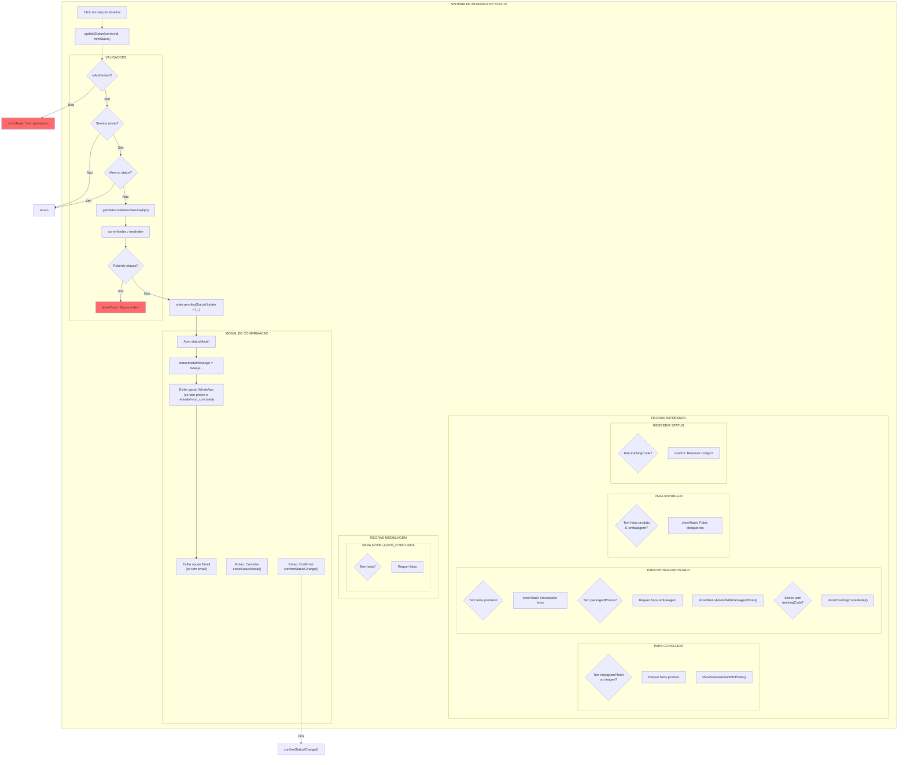

---

## 10. CONFIRMAR MUDANCA DE STATUS

```mermaid
flowchart TD
    subgraph CONFIRM_STATUS["CONFIRMAR MUDANCA DE STATUS"]
        BTN_CONFIRM["Click: Confirmar"]
        GET_PENDING["Obtem state.pendingStatusUpdate"]
        GET_OPTIONS["sendWhatsapp, sendEmail"]

        subgraph WITH_PACKAGED["COM FOTOS EMBALAGEM"]
            CHECK_PACKAGED_PHOTOS{"pendingPackagedPhotos > 0?"}
            ERROR_NO_PACKAGED["showToast: Selecione fotos"]

            CHECK_SEDEX_CODE{"Sedex sem codigo?"}
            GET_TRACKING["Obtem statusTrackingCodeInput"]
            VALIDATE_TRACKING{"Codigo valido?<br/>(min 10 chars)"}
            ERROR_TRACKING["showToast: Codigo invalido"]

            TOAST_UPLOAD_P["showToast: Preparando upload"]
            UPLOAD_PACKAGED["uploadMultipleFiles(packaged)"]
            UPDATE_PACKAGED["Atualiza packagedPhotos"]

            SET_STATUS_RET["status = retirada<br/>readyAt = now"]
            SET_TRACKING["trackingCode = codigo<br/>postedAt = now"]

            UPDATE_DB_PACK["db.update({...})"]
            TOAST_PACK_OK["showToast: Fotos anexadas"]

            SEND_WHATS_PACK{"sendWhatsapp?"}
            WHATS_POSTADO["Mensagem: Pedido postado<br/>+ link rastreio"]
        end

        subgraph WITH_INSTAGRAM["COM FOTOS INSTAGRAM"]
            CHECK_INSTA_PHOTOS{"pendingInstagramPhotos > 0?"}
            ERROR_NO_INSTA["showToast: Selecione fotos"]

            TOAST_UPLOAD_I["showToast: Preparando upload"]
            UPLOAD_INSTA["uploadMultipleFiles(instagram)"]
            UPDATE_IMAGES["Atualiza images[]<br/>instagramPhoto = primeiro"]

            SET_STATUS_CONC["status = concluido/modelagem_concluida<br/>completedAt = now"]
            UPDATE_DB_INSTA["db.update({...})"]
            TOAST_INSTA_OK["showToast: Fotos anexadas"]
        end

        subgraph NORMAL_STATUS["MUDANCA NORMAL"]
            BUILD_UPDATES["Monta objeto updates"]
            SET_NEW_STATUS["status = newStatus<br/>updatedAt, updatedBy"]

            subgraph TIMESTAMPS["TIMESTAMPS"]
                CHECK_ADVANCE{"Avancando?"}
                SET_TS_PROD["productionStartedAt"]
                SET_TS_CONC["completedAt"]
                SET_TS_RET["readyAt"]
                SET_TS_ENT["deliveredAt"]

                CHECK_REGRESS{"Regredindo?"}
                DELETE_TS["Remove timestamps<br/>posteriores"]
                DELETE_TRACK["Remove trackingCode<br/>se aplicavel"]
            end

            UPDATE_DB_NORMAL["db.update(updates)"]
            TOAST_STATUS_OK["showToast: Status atualizado"]
        end

        subgraph NOTIFICATIONS["NOTIFICACOES"]
            CHECK_WHATS{"sendWhatsapp<br/>e tem phone?"}
            BUILD_MESSAGE["Monta mensagem<br/>por status"]
            SEND_WHATSAPP["sendWhatsAppMessage()"]

            CHECK_EMAIL_N{"sendEmail<br/>e tem email?"}
            SEND_EMAIL_N["sendEmailNotification()"]
        end

        CLOSE_STATUS_MODAL["closeStatusModal()"]
    end

    BTN_CONFIRM --> GET_PENDING
    GET_PENDING --> GET_OPTIONS

    GET_OPTIONS -->|requiresPackagedPhoto| CHECK_PACKAGED_PHOTOS
    CHECK_PACKAGED_PHOTOS -->|0| ERROR_NO_PACKAGED
    CHECK_PACKAGED_PHOTOS -->|> 0| CHECK_SEDEX_CODE
    CHECK_SEDEX_CODE -->|Sim| GET_TRACKING
    GET_TRACKING --> VALIDATE_TRACKING
    VALIDATE_TRACKING -->|Nao| ERROR_TRACKING
    VALIDATE_TRACKING -->|Sim| TOAST_UPLOAD_P
    CHECK_SEDEX_CODE -->|Nao| TOAST_UPLOAD_P
    TOAST_UPLOAD_P --> UPLOAD_PACKAGED
    UPLOAD_PACKAGED --> UPDATE_PACKAGED
    UPDATE_PACKAGED --> SET_STATUS_RET
    SET_STATUS_RET --> SET_TRACKING
    SET_TRACKING --> UPDATE_DB_PACK
    UPDATE_DB_PACK --> TOAST_PACK_OK
    TOAST_PACK_OK --> SEND_WHATS_PACK
    SEND_WHATS_PACK -->|Sim| WHATS_POSTADO
    WHATS_POSTADO --> CLOSE_STATUS_MODAL
    SEND_WHATS_PACK -->|Nao| CLOSE_STATUS_MODAL

    GET_OPTIONS -->|requiresInstagramPhoto| CHECK_INSTA_PHOTOS
    CHECK_INSTA_PHOTOS -->|0| ERROR_NO_INSTA
    CHECK_INSTA_PHOTOS -->|> 0| TOAST_UPLOAD_I
    TOAST_UPLOAD_I --> UPLOAD_INSTA
    UPLOAD_INSTA --> UPDATE_IMAGES
    UPDATE_IMAGES --> SET_STATUS_CONC
    SET_STATUS_CONC --> UPDATE_DB_INSTA
    UPDATE_DB_INSTA --> TOAST_INSTA_OK
    TOAST_INSTA_OK --> CLOSE_STATUS_MODAL

    GET_OPTIONS -->|normal| BUILD_UPDATES
    BUILD_UPDATES --> SET_NEW_STATUS
    SET_NEW_STATUS --> CHECK_ADVANCE
    CHECK_ADVANCE -->|Sim| SET_TS_PROD
    CHECK_ADVANCE -->|Nao| CHECK_REGRESS
    CHECK_REGRESS -->|Sim| DELETE_TS
    SET_TS_PROD --> UPDATE_DB_NORMAL
    DELETE_TS --> UPDATE_DB_NORMAL
    UPDATE_DB_NORMAL --> TOAST_STATUS_OK
    TOAST_STATUS_OK --> CHECK_WHATS
    CHECK_WHATS -->|Sim| BUILD_MESSAGE
    BUILD_MESSAGE --> SEND_WHATSAPP
    SEND_WHATSAPP --> CHECK_EMAIL_N
    CHECK_WHATS -->|Nao| CHECK_EMAIL_N
    CHECK_EMAIL_N -->|Sim| SEND_EMAIL_N
    SEND_EMAIL_N --> CLOSE_STATUS_MODAL
    CHECK_EMAIL_N -->|Nao| CLOSE_STATUS_MODAL

    style CLOSE_STATUS_MODAL fill:#51cf66
    style ERROR_NO_PACKAGED fill:#ff6b6b
    style ERROR_TRACKING fill:#ff6b6b
    style ERROR_NO_INSTA fill:#ff6b6b
```

---

## 11. EXCLUIR SERVICO

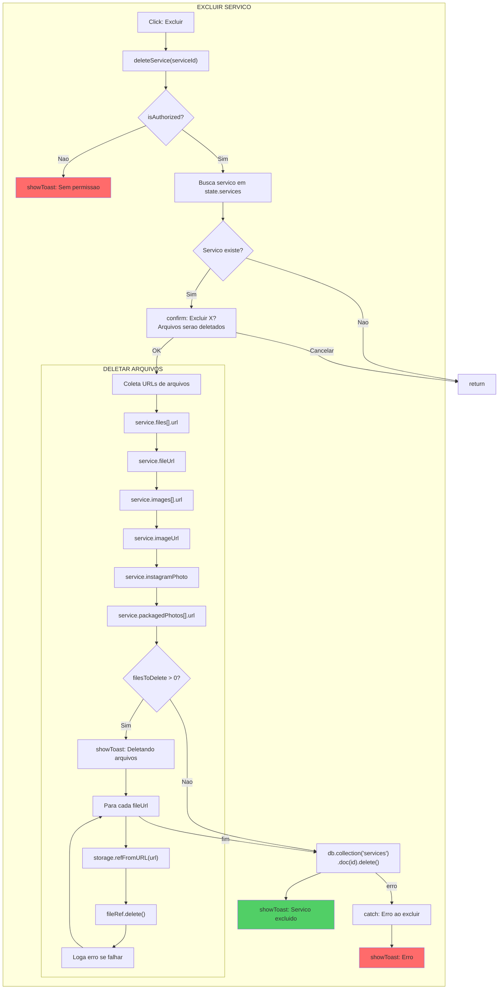

---

## 12. MODAIS DE VISUALIZACAO

```mermaid
flowchart TD
    subgraph MODAIS["MODAIS DE VISUALIZACAO"]
        subgraph FILES_MODAL["MODAL DE ARQUIVOS"]
            CLICK_FILES["Click: X Arquivos"]
            CALL_SHOW_FILES["showServiceFiles(id)"]
            FIND_SERVICE_F["Busca servico"]
            GET_ALL_FILES["Coleta service.files[]<br/>ou service.fileUrl"]

            CHECK_FILES{"files > 0?"}
            SHOW_FILES_MODAL["showFilesModal(name, files, id)"]

            RENDER_FILES["Renderiza lista de arquivos"]
            EACH_FILE["Para cada arquivo"]
            FILE_ICON["Icone por extensao<br/>stl=cube, pdf=pdf..."]
            FILE_INFO["Nome + Tamanho + Data"]
            BTN_OPEN_FILE["Botao: Abrir<br/>window.open(url)"]
            BTN_DOWNLOAD_FILE["Botao: Baixar<br/>download attr"]
            BTN_REMOVE_FILE["Botao: Remover<br/>removeFileFromService()"]

            BTN_CLOSE_FILES["Botao: Fechar<br/>closeFilesModal()"]
        end

        subgraph IMAGES_MODAL["MODAL DE IMAGENS"]
            CLICK_IMAGES["Click: X Imagens"]
            CALL_SHOW_IMAGES["showServiceImages(id)"]
            FIND_SERVICE_I["Busca servico"]

            COLLECT_IMAGES["Coleta todas as imagens"]
            FROM_IMAGES["service.images[]"]
            FROM_IMAGE_URL["service.imageUrl"]
            FROM_INSTA["service.instagramPhoto"]
            FROM_PACKAGED["service.packagedPhotos[]"]

            CHECK_IMAGES{"images > 0?"}
            SHOW_GALLERY["showImagesGallery(images, name, id)"]

            RENDER_GALLERY["Renderiza grid de imagens"]
            EACH_IMAGE["Para cada imagem"]
            IMAGE_THUMB["Thumbnail clicavel"]
            INSTA_BADGE["Badge Instagram"]
            PACKAGED_BADGE["Badge Embalado"]
            BTN_REMOVE_IMG["Botao: Remover<br/>removeImageFromGallery()"]

            CLICK_THUMB["Click em thumbnail"]
            VIEW_FULL["viewFullImageFromGallery(index)"]

            RESTORE_VIEWER["Restaura estrutura viewer"]
            UPDATE_VIEWER["updateImageViewer()"]
            SET_STATE["state.currentImageGallery<br/>state.currentImageIndex"]

            BTN_PREV["Botao: Anterior<br/>prevImage()"]
            BTN_NEXT["Botao: Proximo<br/>nextImage()"]
            BTN_DOWNLOAD_IMG["Botao: Baixar<br/>downloadFile()"]
            BTN_NEW_TAB["Botao: Nova Aba<br/>window.open()"]
            BTN_CLOSE_IMG["Botao: Fechar<br/>closeImageModal()"]
        end

        subgraph DELIVERY_MODAL["MODAL DE ENTREGA"]
            CLICK_DELIVERY["Click: Ver Entrega"]
            CALL_SHOW_DELIVERY["showDeliveryInfo(id)"]
            FIND_SERVICE_D["Busca servico"]

            BUILD_HTML["Monta HTML"]
            SHOW_METHOD["Exibe metodo de entrega"]

            CHECK_METHOD{"Metodo?"}

            SHOW_PICKUP["Exibe info retirada<br/>Nome + WhatsApp<br/>Link wa.me"]

            SHOW_SEDEX["Exibe endereco completo<br/>Nome, CPF, Email, Tel<br/>CEP, Rua, Numero, etc"]

            BTN_CLOSE_DEL["Botao: Fechar<br/>closeDeliveryModal()"]
        end
    end

    CLICK_FILES --> CALL_SHOW_FILES
    CALL_SHOW_FILES --> FIND_SERVICE_F
    FIND_SERVICE_F --> GET_ALL_FILES
    GET_ALL_FILES --> CHECK_FILES
    CHECK_FILES -->|Sim| SHOW_FILES_MODAL
    SHOW_FILES_MODAL --> RENDER_FILES
    RENDER_FILES --> EACH_FILE
    EACH_FILE --> FILE_ICON
    FILE_ICON --> FILE_INFO
    FILE_INFO --> BTN_OPEN_FILE
    BTN_OPEN_FILE --> BTN_DOWNLOAD_FILE
    BTN_DOWNLOAD_FILE --> BTN_REMOVE_FILE

    CLICK_IMAGES --> CALL_SHOW_IMAGES
    CALL_SHOW_IMAGES --> FIND_SERVICE_I
    FIND_SERVICE_I --> COLLECT_IMAGES
    COLLECT_IMAGES --> FROM_IMAGES
    FROM_IMAGES --> FROM_IMAGE_URL
    FROM_IMAGE_URL --> FROM_INSTA
    FROM_INSTA --> FROM_PACKAGED
    FROM_PACKAGED --> CHECK_IMAGES
    CHECK_IMAGES -->|Sim| SHOW_GALLERY
    SHOW_GALLERY --> RENDER_GALLERY
    RENDER_GALLERY --> EACH_IMAGE
    EACH_IMAGE --> IMAGE_THUMB
    IMAGE_THUMB --> CLICK_THUMB
    CLICK_THUMB --> VIEW_FULL
    VIEW_FULL --> RESTORE_VIEWER
    RESTORE_VIEWER --> UPDATE_VIEWER
    UPDATE_VIEWER --> SET_STATE

    CLICK_DELIVERY --> CALL_SHOW_DELIVERY
    CALL_SHOW_DELIVERY --> FIND_SERVICE_D
    FIND_SERVICE_D --> BUILD_HTML
    BUILD_HTML --> SHOW_METHOD
    SHOW_METHOD --> CHECK_METHOD
    CHECK_METHOD -->|retirada| SHOW_PICKUP
    CHECK_METHOD -->|sedex| SHOW_SEDEX
```

---

## 13. UPLOAD DE ARQUIVOS - FLUXO DETALHADO

```mermaid
flowchart TD
    subgraph UPLOAD["SISTEMA DE UPLOAD"]
        subgraph FILE_SELECT["SELECAO DE ARQUIVOS"]
            INPUT_FILES["input type=file multiple"]
            ON_CHANGE_F["handleFileSelect(event)"]
            GET_FILES_F["event.target.files"]

            VALIDATE_EXT{"Extensao valida?<br/>stl,obj,step,3mf,zip,<br/>txt,mtl,rar,7z,pdf"}
            ERROR_EXT["Ignora arquivo invalido"]

            ADD_TO_STATE["state.selectedFiles.push(file)"]

            RENDER_PREVIEW_F["Renderiza preview"]
            CREATE_WRAPPER["Cria file-item-wrapper"]
            SHOW_ICON_F["Icone por extensao"]
            SHOW_NAME_F["Nome do arquivo"]
            SHOW_SIZE_F["Tamanho formatado"]
            BTN_REMOVE_F["Botao X para remover"]

            SHOW_PREVIEW_F["filesPreview.style = block"]
        end

        subgraph IMAGE_SELECT["SELECAO DE IMAGENS"]
            INPUT_IMAGES["input type=file multiple<br/>accept=image/*"]
            ON_CHANGE_I["handleImageSelect(event)"]
            GET_FILES_I["event.target.files"]

            VALIDATE_IMG{"Extensao valida?<br/>jpg,png,gif,webp,bmp,svg"}
            ERROR_IMG["Ignora arquivo invalido"]

            ADD_TO_STATE_I["state.selectedImages.push(file)"]

            CREATE_READER["FileReader()"]
            READ_AS_URL["reader.readAsDataURL(file)"]
            ON_LOAD["reader.onload"]

            RENDER_PREVIEW_I["Renderiza preview"]
            CREATE_WRAPPER_I["Cria preview-image-wrapper"]
            SHOW_THUMB["Thumbnail da imagem"]
            BTN_REMOVE_I["Botao X para remover"]

            SHOW_PREVIEW_I["imagePreview.style = block"]
        end

        subgraph UPLOAD_PROCESS["PROCESSO DE UPLOAD"]
            CALL_UPLOAD["uploadMultipleFiles(files, serviceId, type)"]
            CHECK_EMPTY{"files vazio?"}
            RETURN_EMPTY["return []"]

            CREATE_PROGRESS["createProgressBar(id, type, total)"]
            SHOW_PROGRESS["Exibe barra de progresso"]

            PARALLEL_UPLOAD["Promise.all()"]
            EACH_FILE_UP["Para cada arquivo"]
            CALL_SINGLE["uploadFile(file, serviceId)"]

            subgraph SINGLE_UPLOAD["UPLOAD INDIVIDUAL"]
                BUILD_NAME["fileName = serviceId_timestamp_name"]
                GET_REF["storage.ref(services/id/fileName)"]
                PUT_FILE["storageRef.put(file)"]
                GET_URL["snapshot.ref.getDownloadURL()"]
                RETURN_DATA["return {url, name, size, uploadedAt}"]

                CATCH_CORS["catch: Erro CORS"]
                TOAST_CORS["showToast: Configure CORS"]
            end

            UPDATE_PROGRESS["updateProgressBar(id, completed, total)"]
            INCREMENT["completed++"]

            REMOVE_PROGRESS["removeProgressBar(id)"]
            FILTER_RESULTS["Filtra resultados nulos"]
            RETURN_RESULTS["return results"]
        end
    end

    INPUT_FILES -->|change| ON_CHANGE_F
    ON_CHANGE_F --> GET_FILES_F
    GET_FILES_F --> VALIDATE_EXT
    VALIDATE_EXT -->|Nao| ERROR_EXT
    VALIDATE_EXT -->|Sim| ADD_TO_STATE
    ADD_TO_STATE --> RENDER_PREVIEW_F
    RENDER_PREVIEW_F --> CREATE_WRAPPER
    CREATE_WRAPPER --> SHOW_ICON_F
    SHOW_ICON_F --> SHOW_NAME_F
    SHOW_NAME_F --> SHOW_SIZE_F
    SHOW_SIZE_F --> BTN_REMOVE_F
    BTN_REMOVE_F --> SHOW_PREVIEW_F

    INPUT_IMAGES -->|change| ON_CHANGE_I
    ON_CHANGE_I --> GET_FILES_I
    GET_FILES_I --> VALIDATE_IMG
    VALIDATE_IMG -->|Nao| ERROR_IMG
    VALIDATE_IMG -->|Sim| ADD_TO_STATE_I
    ADD_TO_STATE_I --> CREATE_READER
    CREATE_READER --> READ_AS_URL
    READ_AS_URL --> ON_LOAD
    ON_LOAD --> RENDER_PREVIEW_I
    RENDER_PREVIEW_I --> CREATE_WRAPPER_I
    CREATE_WRAPPER_I --> SHOW_THUMB
    SHOW_THUMB --> BTN_REMOVE_I
    BTN_REMOVE_I --> SHOW_PREVIEW_I

    CALL_UPLOAD --> CHECK_EMPTY
    CHECK_EMPTY -->|Sim| RETURN_EMPTY
    CHECK_EMPTY -->|Nao| CREATE_PROGRESS
    CREATE_PROGRESS --> SHOW_PROGRESS
    SHOW_PROGRESS --> PARALLEL_UPLOAD
    PARALLEL_UPLOAD --> EACH_FILE_UP
    EACH_FILE_UP --> CALL_SINGLE
    CALL_SINGLE --> BUILD_NAME
    BUILD_NAME --> GET_REF
    GET_REF --> PUT_FILE
    PUT_FILE --> GET_URL
    GET_URL --> RETURN_DATA
    PUT_FILE -->|erro| CATCH_CORS
    CATCH_CORS --> TOAST_CORS
    RETURN_DATA --> UPDATE_PROGRESS
    UPDATE_PROGRESS --> INCREMENT
    INCREMENT --> EACH_FILE_UP
    PARALLEL_UPLOAD -->|fim| REMOVE_PROGRESS
    REMOVE_PROGRESS --> FILTER_RESULTS
    FILTER_RESULTS --> RETURN_RESULTS
```

---

## 14. INTEGRACAO COM ESTOQUE

```mermaid
flowchart TD
    subgraph STOCK["INTEGRACAO COM ESTOQUE"]
        subgraph LOAD_STOCK["CARREGAR ESTOQUE"]
            CALL_LOAD["loadAvailableFilaments()"]
            GET_SNAPSHOT["db.collection('filaments').get()"]
            MAP_DOCS["Mapeia documentos"]
            SET_AVAILABLE["availableFilaments = [...]"]
            RETURN_FILAMENTS["return availableFilaments"]
        end

        subgraph UPDATE_MATERIAL["ATUALIZAR MATERIAIS"]
            CALL_UPDATE_MAT["updateMaterialDropdown()"]
            FILTER_IN_STOCK["Filtra weight > 0"]
            GET_UNIQUE_TYPES["Tipos unicos de materiais"]
            SORT_MATERIALS["Ordena alfabeticamente"]

            BUILD_OPTIONS["Constroi options"]
            DEFAULT_OPT["Selecione o material"]
            EACH_MATERIAL["Para cada material"]
            ADD_OPTION["Adiciona option"]
        end

        subgraph UPDATE_COLOR["ATUALIZAR CORES"]
            ON_MATERIAL_CHANGE["handleMaterialChange(event)"]
            GET_SELECTED["selectedMaterial = value"]
            CALL_UPDATE_COLOR["updateColorDropdown(material)"]

            FILTER_BY_MAT["Filtra por material<br/>e weight > 0"]
            GROUP_BY_COLOR["Agrupa por cor"]
            FIND_BEST_BRAND["Encontra melhor marca<br/>(maior estoque)"]
            SORT_COLORS["Ordena cores"]

            BUILD_COLOR_OPT["Constroi options"]
            SHOW_BRAND_INFO["Exibe marca e quantidade"]
        end

        subgraph CHECK_STOCK["VERIFICAR ESTOQUE"]
            CALL_CHECK["checkStockAvailability(mat, cor, peso)"]
            FIND_BEST["findBestFilament(mat, cor)"]

            CHECK_FOUND{"Encontrou?"}
            NOT_FOUND["return {hasStock: false, notFound: true}"]

            CALC_AVAILABLE["availableGrams = weight * 1000"]
            COMPARE{"peso <= disponivel?"}
            HAS_STOCK["return {hasStock: true, ...}"]
            NO_STOCK["return {hasStock: false, needed, available}"]
        end

        subgraph DEDUCT_STOCK["DEDUZIR DO ESTOQUE"]
            CALL_DEDUCT["deductMaterialFromStock(mat, cor, peso)"]

            CHECK_RETURN{"peso < 0?<br/>(devolucao)"}

            FIND_ANY["Busca qualquer filamento<br/>correspondente"]
            FIND_BEST_D["findBestFilament(mat, cor)"]

            CHECK_FOUND_D{"Encontrou?"}
            WARN_NOT_FOUND["console.warn: Nao encontrado"]

            CALC_NEW_WEIGHT["newWeight = current +/- peso"]
            UPDATE_FIRESTORE["db.collection('filaments')<br/>.doc(id).update({weight})"]

            LOG_ACTION["Log: Estoque atualizado"]
            TOAST_STOCK["showToast: +/-Xg de material"]
            UPDATE_CACHE["Atualiza cache local"]
        end
    end

    CALL_LOAD --> GET_SNAPSHOT
    GET_SNAPSHOT --> MAP_DOCS
    MAP_DOCS --> SET_AVAILABLE
    SET_AVAILABLE --> RETURN_FILAMENTS

    CALL_UPDATE_MAT --> FILTER_IN_STOCK
    FILTER_IN_STOCK --> GET_UNIQUE_TYPES
    GET_UNIQUE_TYPES --> SORT_MATERIALS
    SORT_MATERIALS --> BUILD_OPTIONS
    BUILD_OPTIONS --> DEFAULT_OPT
    DEFAULT_OPT --> EACH_MATERIAL
    EACH_MATERIAL --> ADD_OPTION

    ON_MATERIAL_CHANGE --> GET_SELECTED
    GET_SELECTED --> CALL_UPDATE_COLOR
    CALL_UPDATE_COLOR --> FILTER_BY_MAT
    FILTER_BY_MAT --> GROUP_BY_COLOR
    GROUP_BY_COLOR --> FIND_BEST_BRAND
    FIND_BEST_BRAND --> SORT_COLORS
    SORT_COLORS --> BUILD_COLOR_OPT
    BUILD_COLOR_OPT --> SHOW_BRAND_INFO

    CALL_CHECK --> FIND_BEST
    FIND_BEST --> CHECK_FOUND
    CHECK_FOUND -->|Nao| NOT_FOUND
    CHECK_FOUND -->|Sim| CALC_AVAILABLE
    CALC_AVAILABLE --> COMPARE
    COMPARE -->|Sim| HAS_STOCK
    COMPARE -->|Nao| NO_STOCK

    CALL_DEDUCT --> CHECK_RETURN
    CHECK_RETURN -->|Sim| FIND_ANY
    CHECK_RETURN -->|Nao| FIND_BEST_D
    FIND_ANY --> CHECK_FOUND_D
    FIND_BEST_D --> CHECK_FOUND_D
    CHECK_FOUND_D -->|Nao| WARN_NOT_FOUND
    CHECK_FOUND_D -->|Sim| CALC_NEW_WEIGHT
    CALC_NEW_WEIGHT --> UPDATE_FIRESTORE
    UPDATE_FIRESTORE --> LOG_ACTION
    LOG_ACTION --> TOAST_STOCK
    TOAST_STOCK --> UPDATE_CACHE
```

---

## 15. SISTEMA DE TOAST E CONEXAO

```mermaid
flowchart TD
    subgraph TOAST["SISTEMA DE TOAST"]
        CALL_TOAST["showToast(message, type)"]
        GET_CONTAINER["toastContainer"]

        CREATE_TOAST["Cria elemento toast"]
        SET_CLASS["toast toast-type"]
        SET_ICON["Icone por tipo"]
        SET_MESSAGE["Mensagem"]

        APPEND_TOAST["container.appendChild(toast)"]

        SET_TIMEOUT["setTimeout 3000ms"]
        FADE_OUT["toast.style.opacity = 0"]
        REMOVE["toast.remove()"]

        subgraph TOAST_TYPES["TIPOS DE TOAST"]
            SUCCESS["success<br/>Verde - Sucesso"]
            ERROR["error<br/>Vermelho - Erro"]
            INFO["info<br/>Azul - Informacao"]
            WARNING["warning<br/>Amarelo - Aviso"]
        end
    end

    subgraph CONNECTION["MONITOR DE CONEXAO"]
        CALL_MONITOR["monitorConnection()"]

        ON_ONLINE["window.addEventListener('online')"]
        SET_ONLINE["Atualiza status: Conectado"]
        TOAST_ONLINE["showToast: Conexao restaurada"]

        ON_OFFLINE["window.addEventListener('offline')"]
        SET_OFFLINE["Atualiza status: Sem conexao"]
        TOAST_OFFLINE["showToast: Sem conexao"]

        STATUS_DOT["connectionStatus<br/>status-dot"]
        STATUS_TEXT["statusText"]
    end

    CALL_TOAST --> GET_CONTAINER
    GET_CONTAINER --> CREATE_TOAST
    CREATE_TOAST --> SET_CLASS
    SET_CLASS --> SET_ICON
    SET_ICON --> SET_MESSAGE
    SET_MESSAGE --> APPEND_TOAST
    APPEND_TOAST --> SET_TIMEOUT
    SET_TIMEOUT --> FADE_OUT
    FADE_OUT --> REMOVE

    CALL_MONITOR --> ON_ONLINE
    CALL_MONITOR --> ON_OFFLINE
    ON_ONLINE --> SET_ONLINE
    SET_ONLINE --> TOAST_ONLINE
    ON_OFFLINE --> SET_OFFLINE
    SET_OFFLINE --> TOAST_OFFLINE
```

---

## RESUMO DE TODOS OS BOTOES E ACOES

| Elemento | Acao/Evento | Funcao Chamada | Consequencia |
|----------|-------------|----------------|--------------|
| Entrar com Google | click | signInWithGoogle() | Popup Google OAuth |
| Sair | click | signOutGlobal() | Logout + tela login |
| Novo Servico | click | openAddModal() | Modal tipo servico |
| Tipo Impressao | click | selectServiceType('impressao') | Modal formulario impressao |
| Tipo Modelagem | click | selectServiceType('modelagem') | Modal formulario modelagem |
| Salvar Servico | submit | saveService(event) | Salva no Firestore |
| Cancelar Modal | click | closeModal() | Fecha modal |
| Card Stat | click | filterServices(filter) | Filtra servicos |
| Editar Card | click | openEditModal(id) | Modal edicao |
| Excluir Card | click | deleteService(id) | Confirma e exclui |
| Step Timeline | click | updateStatus(id, status) | Modal confirmacao |
| Confirmar Status | click | confirmStatusChange() | Atualiza status |
| Ver Arquivos | click | showServiceFiles(id) | Modal arquivos |
| Ver Imagens | click | showServiceImages(id) | Modal galeria |
| Ver Entrega | click | showDeliveryInfo(id) | Modal entrega |
| Contatar | click | contactClient() | Abre WhatsApp |
| Material select | change | handleMaterialChange() | Atualiza cores |
| Entrega select | change | toggleDeliveryFields() | Mostra campos |
| CEP input | blur | buscarCEP() | Preenche endereco |
| Data indefinida | change | toggleDateInput() | Desabilita dueDate |
| Upload arquivo | change | handleFileSelect() | Preview arquivos |
| Upload imagem | change | handleImageSelect() | Preview imagens |
| Nome cliente | input | handleClientNameInput() | Autocomplete |
| Sugestao cliente | click | selectClient(id) | Preenche campos |
| Imagem galeria | click | viewFullImageFromGallery(i) | Viewer imagem |
| Prev imagem | click | prevImage() | Imagem anterior |
| Next imagem | click | nextImage() | Proxima imagem |
| Baixar imagem | click | downloadFile() | Download |
| Remover arquivo | click | removeFileFromService() | Deleta arquivo |
| Remover imagem | click | removeImageFromGallery() | Deleta imagem |
| Link Estoque | click | href=/estoque/ | Navega estoque |
| Link Caixa | click | href=/caixa/ | Navega caixa |
| Link Custo | click | href=/custo/ | Navega custo |
| Link Financas | click | href=/financas/ | Navega financas |

---

*Fluxograma gerado para identificacao completa de quebras de logica no painel de servicos ImaginaTech*
